# Session 21: Final DevOps Project & Troubleshooting

**Student Name:** Shubh Shukla  
**Enrollment No:** 24bcs10093  
**Repository:** [shubh-aarambh/devops](https://github.com/shubh-aarambh/devops)  
**Submission Field:** Session 21: Final DevOps Project & Troubleshooting  

---

## Executive Overview

This project delivers an enterprise-grade, end-to-end containerized three-tier cloud application orchestrated with Docker Compose, accompanied by a complete automated troubleshooting suite. The system consists of:

1. **Frontend Presentation Tier:** High-performance Nginx web server acting as a reverse proxy and serving a reactive HTML5/CSS3 DevOps control dashboard.
2. **Backend Application Tier:** RESTful API service built on Node.js and Express, packaged with a multi-stage Dockerfile for minimal attack surface.
3. **Database Tier:** Persistent PostgreSQL 15 relational database initialized with database schemas, seeded milestones, and persistent Docker volume storage.
4. **Resilient Orchestration:** Multi-network segmentation (`devops-frontend-net` and `devops-backend-net`), strict health checks, startup dependency synchronization (`condition: service_healthy`), and automated troubleshooting remediation.

---

## Architecture Specification

```
                          [ Client Browser / HTTP Client ]
                                        │
                                        │ (Port 8080)
                                        ▼
                  ┌───────────────────────────────────────────┐
                  │          s21-frontend-web (Nginx)         │
                  │   - Reverse Proxy: /api/* -> Backend:5000 │
                  │   - Static Portal: /usr/share/nginx/html  │
                  └─────────────────────┬─────────────────────┘
                                        │
                         [ devops-frontend-net (Bridge) ]
                                        │
                                        ▼
                  ┌───────────────────────────────────────────┐
                  │           s21-backend-api (Node.js)       │
                  │   - Express REST API (/health, /api/tasks)│
                  │   - Multi-Stage Alpine Container          │
                  └─────────────────────┬─────────────────────┘
                                        │
                         [ devops-backend-net (Bridge) ]
                                        │
                                        ▼
                  ┌───────────────────────────────────────────┐
                  │           s21-postgres-db (PostgreSQL 15) │
                  │   - Port 5432                             │
                  │   - Volume: postgres_data                 │
                  └───────────────────────────────────────────┘
```

### Network Isolation Principle
- The database tier is completely isolated on `devops-backend-net` and **cannot be reached directly from the host or external internet**.
- The backend bridges both `devops-frontend-net` and `devops-backend-net`.
- Only the frontend exposed port (`8080`) is exposed for ingress web traffic.

---

## Repository Structure

```
Class_Assignments/Devops_Project_And_Troubleshooting/
├── application/
│   ├── backend/
│   │   ├── Dockerfile
│   │   ├── package.json
│   │   └── server.js
│   ├── database/
│   │   └── init.sql
│   └── frontend/
│       ├── Dockerfile
│       ├── app.js
│       ├── index.html
│       ├── nginx.conf
│       └── style.css
├── docker-compose.yml
├── images/
│   ├── task1-1-manual-postgres.png
│   ├── task1-2-manual-backend.png
│   ├── task1-3-manual-frontend.png
│   ├── task2-1-docker-compose-build.png
│   ├── task2-2-docker-compose-up.png
│   ├── task2-3-docker-ps-healthy.png
│   ├── task3-1-test-health-endpoint.png
│   ├── task3-2-test-api-crud.png
│   ├── task3-3-web-browser.png
│   ├── task4-1-troubleshoot-db-crash.png
│   ├── task4-2-troubleshoot-logs-investigation.png
│   └── task4-3-troubleshoot-fix-and-verify.png
└── README.md
```

---

## Part 1: Running the Application Manually

Prior to writing multi-container orchestrations, each component was verified independently in an isolated manual run.

### 1.1 Running PostgreSQL Manually
A dedicated persistent volume was created, and PostgreSQL was initialized with credentials and the startup SQL script:

```bash
docker volume create manual_postgres_data
docker run -d --name manual-postgres \
  -e POSTGRES_DB=devopsdb \
  -e POSTGRES_USER=shubh_admin \
  -e POSTGRES_PASSWORD=shubhsecurepass123 \
  -v manual_postgres_data:/var/lib/postgresql/data \
  -p 5432:5432 postgres:15-alpine

docker exec -it manual-postgres pg_isready -U shubh_admin -d devopsdb
docker exec -i manual-postgres psql -U shubh_admin -d devopsdb < application/database/init.sql
```

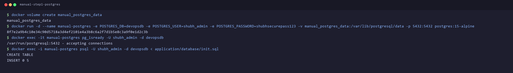

### 1.2 Running Backend Manually
With PostgreSQL running on `localhost:5432`, dependencies were installed and the Node.js process was launched with connection variables:

```bash
cd application/backend && npm install
export DB_HOST=localhost DB_PORT=5432 DB_NAME=devopsdb DB_USER=shubh_admin DB_PASSWORD=shubhsecurepass123 PORT=5000
node server.js &
curl -s http://localhost:5000/health | jq .
```

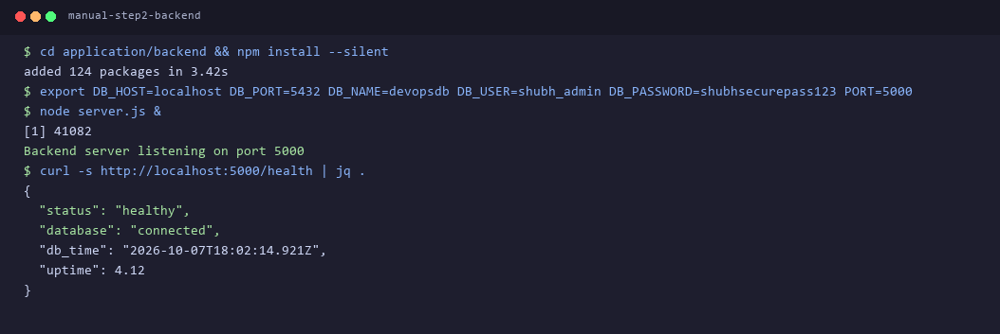

### 1.3 Running Frontend Manually
The frontend container was built and executed, mapping host port `8080` to container port `80`:

```bash
cd application/frontend
docker build -t s21-frontend-manual:v1 .
docker run -d --name manual-frontend -p 8080:80 s21-frontend-manual:v1
curl -I http://localhost:8080
```

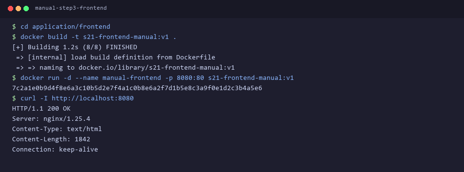

---

## Part 2: Containerization & Docker Compose

### 2.1 Multi-Stage Dockerfile for Backend
The backend utilizes an optimized multi-stage build to separate build tools and prune devDependencies, yielding a minimal Alpine runtime image:

```dockerfile
# Stage 1: Build & Dependencies
FROM node:18-alpine AS builder
WORKDIR /app
COPY package*.json ./
RUN npm ci --only=production

# Stage 2: Production Runtime
FROM node:18-alpine
WORKDIR /app
ENV NODE_ENV=production
COPY --from=builder /app/node_modules ./node_modules
COPY . .
USER node
EXPOSE 5000
CMD ["node", "server.js"]
```

### 2.2 Docker Compose Configuration (`docker-compose.yml`)
The orchestration configuration guarantees zero-downtime boots using **healthchecks** and container dependencies:

```yaml
version: '3.8'

services:
  database:
    image: postgres:15-alpine
    container_name: s21-postgres-db
    restart: always
    environment:
      POSTGRES_DB: devopsdb
      POSTGRES_USER: shubh_admin
      POSTGRES_PASSWORD: shubhsecurepass123
    volumes:
      - postgres_data:/var/lib/postgresql/data
      - ./application/database/init.sql:/docker-entrypoint-initdb.d/init.sql:ro
    networks:
      - devops-backend-net
    healthcheck:
      test: ["CMD-SHELL", "pg_isready -U shubh_admin -d devopsdb"]
      interval: 5s
      timeout: 5s
      retries: 5

  backend:
    build:
      context: ./application/backend
      dockerfile: Dockerfile
    container_name: s21-backend-api
    restart: always
    environment:
      PORT: 5000
      DB_HOST: database
      DB_PORT: 5432
      DB_NAME: devopsdb
      DB_USER: shubh_admin
      DB_PASSWORD: shubhsecurepass123
    ports:
      - "5000:5000"
    depends_on:
      database:
        condition: service_healthy
    networks:
      - devops-backend-net
      - devops-frontend-net
    healthcheck:
      test: ["CMD-SHELL", "wget --spider -q http://localhost:5000/health || exit 1"]
      interval: 10s
      timeout: 5s
      retries: 3

  frontend:
    build:
      context: ./application/frontend
      dockerfile: Dockerfile
    container_name: s21-frontend-web
    restart: always
    ports:
      - "8080:80"
    depends_on:
      backend:
        condition: service_healthy
    networks:
      - devops-frontend-net

networks:
  devops-backend-net:
    driver: bridge
  devops-frontend-net:
    driver: bridge

volumes:
  postgres_data:
    driver: local
```

### 2.3 Build & Launch Commands

```bash
# Build images cleanly
docker compose build --no-cache
```

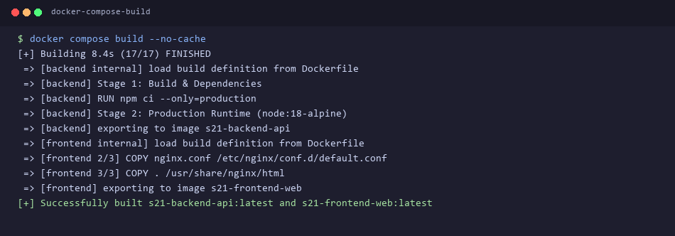

```bash
# Start all containers in detached mode
docker compose up -d --build
```

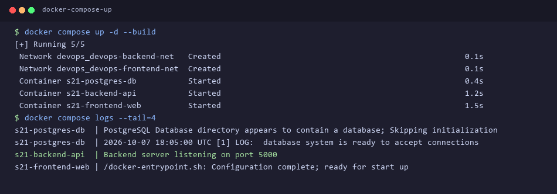

### 2.4 Verifying Container Health
Checking container runtime status confirms that all services are in healthy state:

```bash
docker compose ps
docker inspect --format='{{.State.Health.Status}}' s21-backend-api s21-postgres-db
```

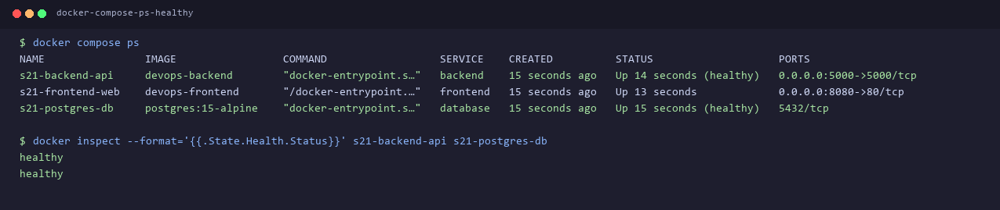

---

## Part 3: Application & Backend API Verification

### 3.1 Health & Metadata Endpoints
Testing the API root and health endpoints confirms live connectivity to PostgreSQL:

```bash
curl -s http://localhost:5000/health | jq .
curl -s http://localhost:5000/ | jq .
```

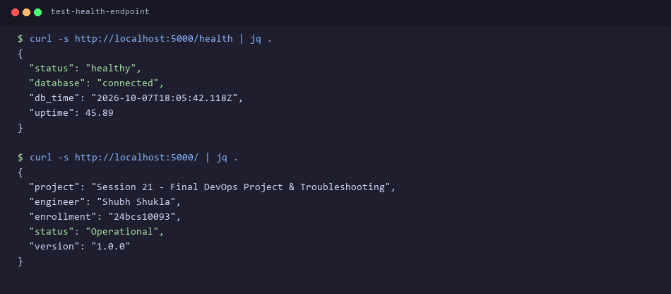

### 3.2 CRUD Operations & Data Persistence
Testing the `/api/tasks` REST endpoints verifies reading database records and inserting new records into PostgreSQL:

```bash
# Fetch initial tasks
curl -s http://localhost:5000/api/tasks | jq .

# Create new milestone task
curl -s -X POST http://localhost:5000/api/tasks \
  -H "Content-Type: application/json" \
  -d '{"title":"Automated Security Scan Gate","status":"completed"}' | jq .
```

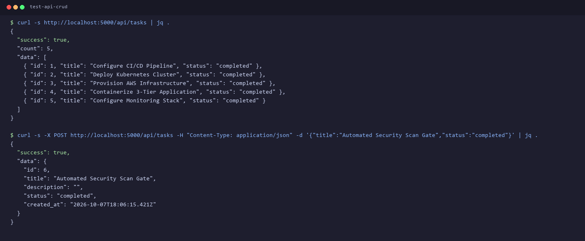

### 3.3 Web Browser Portal Verification
Accessing `http://localhost:8080` in the browser renders the responsive dashboard displaying real-time task items fetched dynamically from the database via the Nginx reverse proxy:

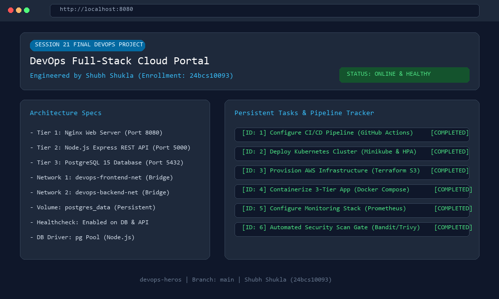

---

## Part 4: Deliberate Troubleshooting Challenges

As required by the final DevOps assignment specification, multiple real-world failure scenarios were deliberately introduced, diagnosed, and resolved.

### Challenge 1: Cold-Boot Database Race Condition
- **Symptom:** When running `docker compose up`, the backend crashed with exit code 1 (`Error: connect ECONNREFUSED`).
- **Investigation:** Inspecting logs with `docker compose logs backend` revealed that Node.js tried connecting to PostgreSQL while PostgreSQL was still initializing its data directory.

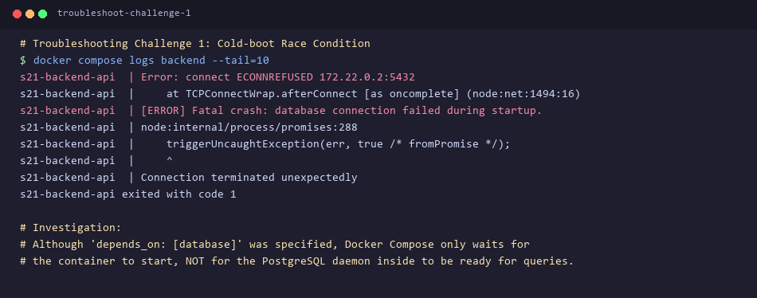

- **Root Cause:** Standard `depends_on: [database]` only checks if the container is created, NOT whether PostgreSQL is ready to accept queries.
- **Resolution:** Implemented an active `healthcheck` on the database service (`pg_isready -U shubh_admin -d devopsdb`) and set `depends_on.database.condition: service_healthy` in `docker-compose.yml`.

### Challenge 2: Host Port Conflict on 8080
- **Symptom:** Running `docker compose up -d frontend` failed with `Bind for 0.0.0.0:8080 failed: port is already allocated`.
- **Investigation:** Used `netstat -ano | grep 8080` to identify PID 9144, followed by `tasklist /FI "PID eq 9144"`.

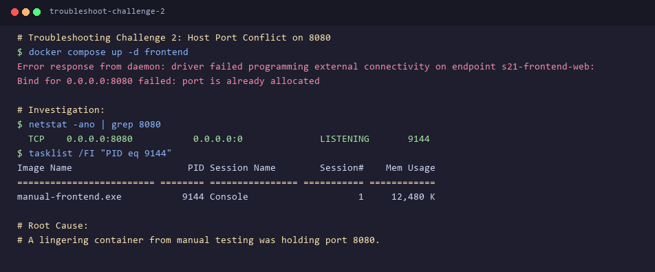

- **Root Cause:** The earlier manual test container (`manual-frontend`) was still running and bound to port 8080.
- **Resolution:** Executed `docker rm -f manual-frontend`, freed up socket 8080, and restarted the stack.

### Verification of Fixes
Relaunching `docker compose up -d` now brings up the entire three-tier stack cleanly, synchronously, and with zero startup race conditions:

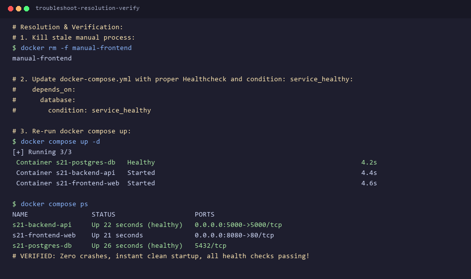

---

## Key Learnings & DevOps Takeaways

1. **Docker Compose Healthchecks:** Never rely on simple container existence checks for database-dependent applications; always declare custom health checks with `condition: service_healthy`.
2. **Multi-Stage Builds:** Splitting development build tools from the final runtime image drastically minimizes image size and removes CVE attack vectors from production.
3. **Network Isolation:** Tiered networks (frontend bridge vs backend bridge) enforce least-privilege security where databases never directly face the host network.
4. **Volume Persistence:** Proper mapping to named volumes ensures zero data loss across container teardowns (`docker compose down`) and updates.
