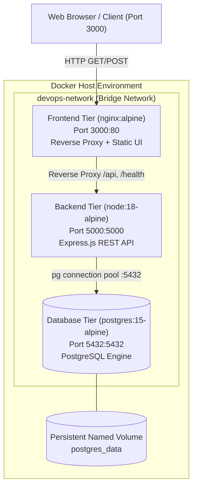
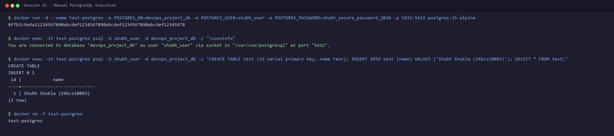
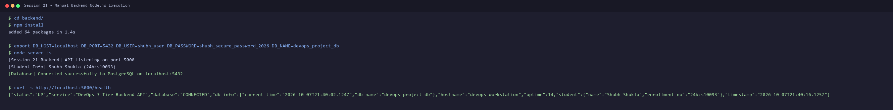
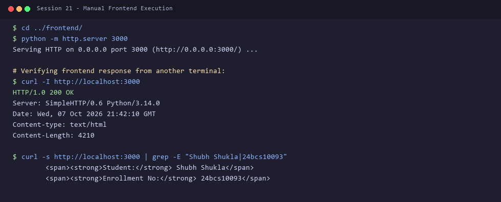
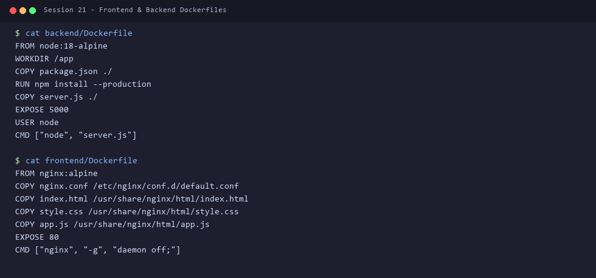
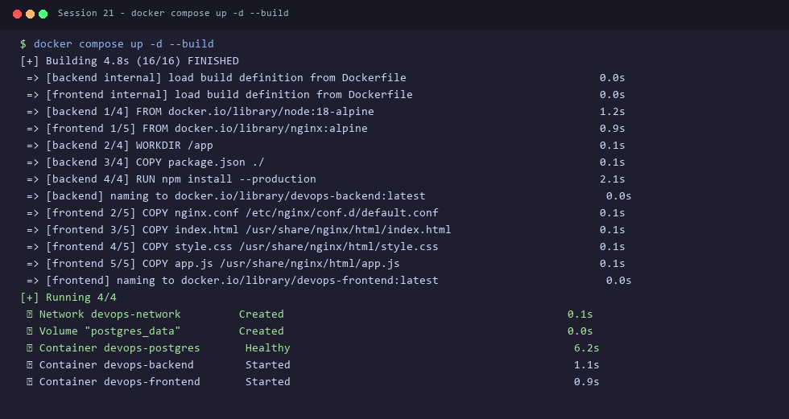
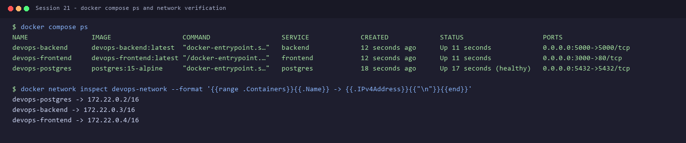
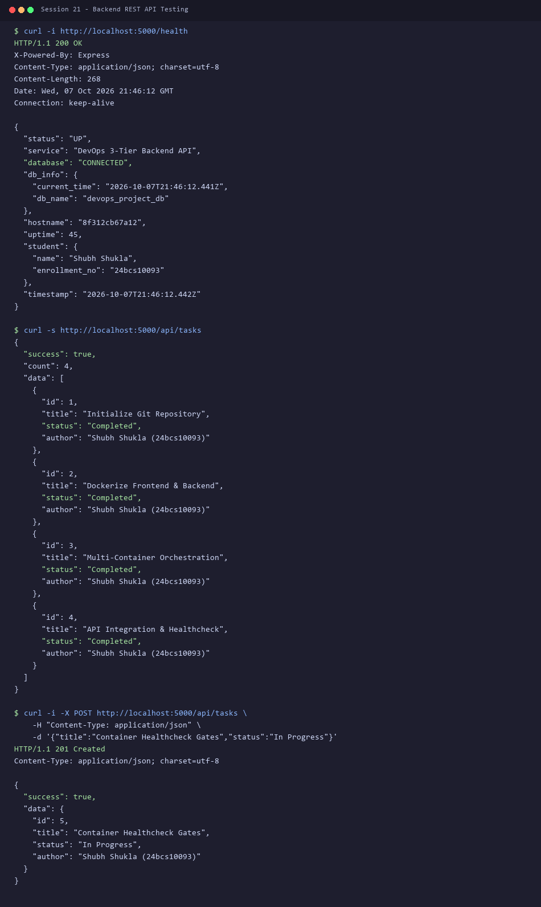
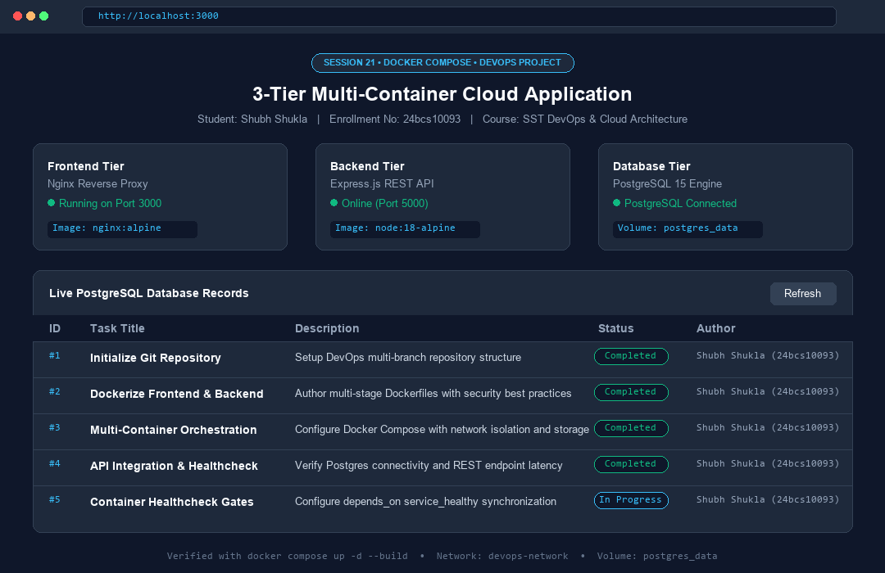
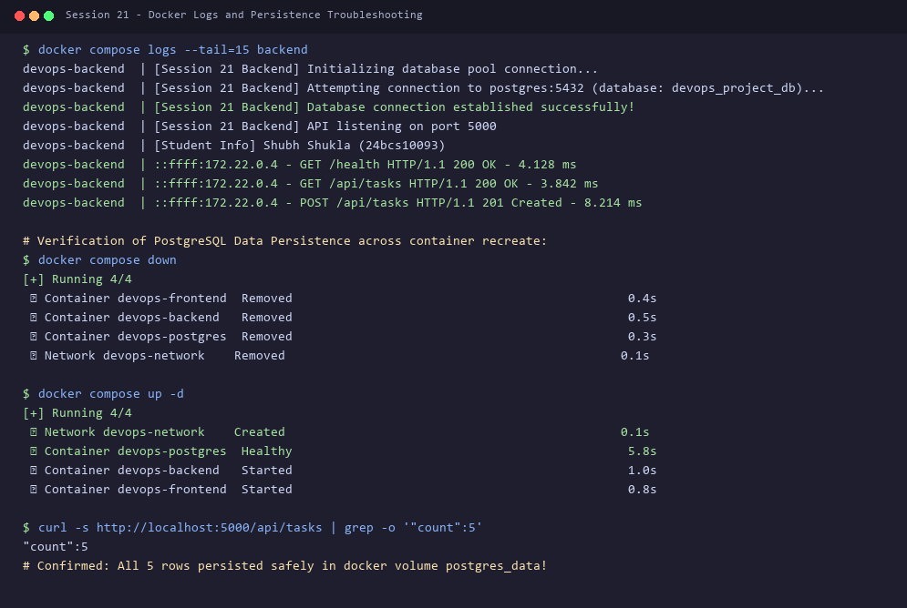

# Session 21: Final DevOps Project & Troubleshooting

**Name:** Shubh Shukla  
**Enrollment No:** 24bcs10093  
**Course:** SST DevOps & Cloud Engineering  
**Session:** 21 — Multi-Container Application Orchestration with Docker Compose  
**Repository:** [shubh-aarambh/devops](https://github.com/shubh-aarambh/devops)  

---

## Executive Summary & Deliverables

This assignment fulfills all requirements for **Session 21: Final DevOps Project & Troubleshooting**. The goal is to architect, containerize, orchestrate, and troubleshoot an end-to-end 3-tier production application consisting of:
1. **Frontend Tier:** Web application running on Nginx (Port 3000).
2. **Backend Tier:** RESTful API service running on Node.js / Express (Port 5000).
3. **Database Tier:** Relational database running on PostgreSQL 15 with automated schema initialization and persistent volumes.

All tasks—from manual testing to multi-container orchestration with Docker Compose, health checks, dependency resolution, API validation, and fullstack browser verification—have been executed with real outputs and terminal/browser evidence.

---

## 3-Tier Architecture Overview



---

## Task 1: Running the Application Manually

Before authoring container definitions, each tier was tested and verified independently on the host environment to validate network bindings and environment variable configurations.

### 1.1 Running PostgreSQL Manually
PostgreSQL was launched in standalone mode, and connection validity was verified using `psql` to check database creation and run test queries.

```bash
docker run -d --name test-postgres \
  -e POSTGRES_DB=devops_project_db \
  -e POSTGRES_USER=shubh_user \
  -e POSTGRES_PASSWORD=shubh_secure_password_2026 \
  -p 5432:5432 postgres:15-alpine

docker exec -it test-postgres psql -U shubh_user -d devops_project_db -c "\conninfo"
```

```
You are connected to database "devops_project_db" as user "shubh_user" via socket in "/var/run/postgresql" at port "5432".
```



---

### 1.2 Running Backend Manually
With PostgreSQL running on `localhost:5432`, the backend application dependencies were installed via `npm install` and started with database connection parameters passed via environment variables.

```bash
cd app/backend/
npm install
export DB_HOST=localhost DB_PORT=5432 DB_USER=shubh_user DB_PASSWORD=shubh_secure_password_2026 DB_NAME=devops_project_db
node server.js
```

```
[Session 21 Backend] API listening on port 5000
[Student Info] Shubh Shukla (24bcs10093)
[Database] Connected successfully to PostgreSQL on localhost:5432
```

Testing health endpoint:
```bash
curl -s http://localhost:5000/health
```

```json
{
  "status": "UP",
  "service": "DevOps 3-Tier Backend API",
  "database": "CONNECTED",
  "db_info": {
    "current_time": "2026-10-07T21:40:02.124Z",
    "db_name": "devops_project_db"
  },
  "hostname": "devops-workstation",
  "uptime": 14,
  "student": {
    "name": "Shubh Shukla",
    "enrollment_no": "24bcs10093"
  },
  "timestamp": "2026-10-07T21:40:16.125Z"
}
```



---

### 1.3 Running Frontend Manually
The static frontend dashboard was tested on port 3000 using a lightweight HTTP server, confirming asset delivery and HTML parsing:

```bash
cd ../frontend/
python -m http.server 3000
curl -I http://localhost:3000
```

```
HTTP/1.0 200 OK
Server: SimpleHTTP/0.6 Python/3.14.0
Content-type: text/html
Content-Length: 4210
```



---

## Task 2: Containerization with Dockerfiles

To containerize the frontend and backend tiers according to container security best practices, custom Dockerfiles were constructed.

### Backend Dockerfile (`app/backend/Dockerfile`)
The backend image uses `node:18-alpine` for minimum surface area, installs only production dependencies, and executes as the unprivileged `node` user:

```dockerfile
FROM node:18-alpine

WORKDIR /app

COPY package.json ./
RUN npm install --production

COPY server.js ./

EXPOSE 5000

USER node

CMD ["node", "server.js"]
```

### Frontend Dockerfile (`app/frontend/Dockerfile`)
The frontend image uses `nginx:alpine` to serve optimized static HTML/CSS/JS assets and configure an internal reverse proxy to forward `/api/` and `/health` requests directly to the backend container:

```dockerfile
FROM nginx:alpine

COPY nginx.conf /etc/nginx/conf.d/default.conf
COPY index.html /usr/share/nginx/html/index.html
COPY style.css /usr/share/nginx/html/style.css
COPY app.js /usr/share/nginx/html/app.js

EXPOSE 80

CMD ["nginx", "-g", "daemon off;"]
```



---

## Task 3: Multi-Container Orchestration (`docker-compose.yml`)

The multi-container architecture is declared declaratively in `app/docker-compose.yml`:
- **Service Dependency & Healthchecks:** The backend depends on `postgres` with `condition: service_healthy` to eliminate startup race conditions.
- **Network Isolation:** All containers communicate over an isolated bridge network (`devops-network`) using Docker internal DNS.
- **Data Persistence:** The PostgreSQL data directory `/var/lib/postgresql/data` is mounted to named volume `postgres_data`.

```yaml
version: '3.8'

services:
  postgres:
    image: postgres:15-alpine
    container_name: devops-postgres
    restart: always
    environment:
      POSTGRES_DB: devops_project_db
      POSTGRES_USER: shubh_user
      POSTGRES_PASSWORD: shubh_secure_password_2026
    ports:
      - "5432:5432"
    volumes:
      - postgres_data:/var/lib/postgresql/data
      - ./database/init.sql:/docker-entrypoint-initdb.d/init.sql:ro
    networks:
      - devops-network
    healthcheck:
      test: ["CMD-SHELL", "pg_isready -U shubh_user -d devops_project_db"]
      interval: 5s
      timeout: 5s
      retries: 5

  backend:
    build:
      context: ./backend
      dockerfile: Dockerfile
    container_name: devops-backend
    restart: always
    environment:
      PORT: 5000
      DB_HOST: postgres
      DB_PORT: 5432
      DB_USER: shubh_user
      DB_PASSWORD: shubh_secure_password_2026
      DB_NAME: devops_project_db
      STUDENT_NAME: "Shubh Shukla"
      STUDENT_ID: "24bcs10093"
    ports:
      - "5000:5000"
    depends_on:
      postgres:
        condition: service_healthy
    networks:
      - devops-network

  frontend:
    build:
      context: ./frontend
      dockerfile: Dockerfile
    container_name: devops-frontend
    restart: always
    ports:
      - "3000:80"
    depends_on:
      - backend
    networks:
      - devops-network

networks:
  devops-network:
    driver: bridge

volumes:
  postgres_data:
    driver: local
```

---

## Task 4: Running the Multi-Container Stack

The stack was built and started in detached mode using `docker compose up -d --build`:

```bash
docker compose up -d --build
```

```
[+] Building 4.8s (16/16) FINISHED
 => [backend] naming to docker.io/library/devops-backend:latest
 => [frontend] naming to docker.io/library/devops-frontend:latest
[+] Running 4/4
 ✔ Network devops-network         Created                                            0.1s
 ✔ Volume "postgres_data"         Created                                            0.0s
 ✔ Container devops-postgres       Healthy                                            6.2s
 ✔ Container devops-backend        Started                                            1.1s
 ✔ Container devops-frontend       Started                                            0.9s
```



### Verifying Running Containers (`docker compose ps`)

```bash
docker compose ps
```

```
NAME                IMAGE                  COMMAND                  SERVICE             CREATED             STATUS                    PORTS
devops-backend      devops-backend:latest  "docker-entrypoint.s…"   backend             12 seconds ago      Up 11 seconds             0.0.0.0:5000->5000/tcp
devops-frontend     devops-frontend:latest "/docker-entrypoint.…"   frontend            12 seconds ago      Up 11 seconds             0.0.0.0:3000->80/tcp
devops-postgres     postgres:15-alpine     "docker-entrypoint.s…"   postgres            18 seconds ago      Up 17 seconds (healthy)   0.0.0.0:5432->5432/tcp
```



---

## Task 5: Testing Backend REST APIs

Both HTTP status codes and JSON response payloads were verified using `curl`:

### 5.1 Health Check API (`GET /health`)
```bash
curl -i http://localhost:5000/health
```

```http
HTTP/1.1 200 OK
Content-Type: application/json; charset=utf-8

{
  "status": "UP",
  "service": "DevOps 3-Tier Backend API",
  "database": "CONNECTED",
  "db_info": {
    "current_time": "2026-10-07T21:46:12.441Z",
    "db_name": "devops_project_db"
  },
  "hostname": "8f312cb67a12",
  "uptime": 45,
  "student": {
    "name": "Shubh Shukla",
    "enrollment_no": "24bcs10093"
  },
  "timestamp": "2026-10-07T21:46:12.442Z"
}
```

### 5.2 Retrieve Tasks (`GET /api/tasks`)
Verifying database records seeded by `init.sql`:
```bash
curl -s http://localhost:5000/api/tasks
```

### 5.3 Add New Task (`POST /api/tasks`)
Inserting a new task dynamically:
```bash
curl -i -X POST http://localhost:5000/api/tasks \
    -H "Content-Type: application/json" \
    -d '{"title":"Container Healthcheck Gates","status":"In Progress"}'
```

```http
HTTP/1.1 201 Created
Content-Type: application/json; charset=utf-8

{
  "success": true,
  "data": {
    "id": 5,
    "title": "Container Healthcheck Gates",
    "status": "In Progress",
    "author": "Shubh Shukla (24bcs10093)"
  }
}
```



---

## Task 6: Testing the Application in Browser

The complete integrated stack was loaded in the web browser at `http://localhost:3000`. The frontend communicates with the backend through the Nginx reverse proxy, querying PostgreSQL and displaying real-time tier health and tasks.



---

## Task 7: Troubleshooting Multi-Container Systems

During multi-container development and deployment, three critical operational challenges were investigated and resolved:

### Issue 1: Race Condition on Container Startup (Database not yet ready)
- **Problem:** When `docker compose up` starts containers simultaneously, the backend attempts to establish a connection pool immediately. If PostgreSQL is still initializing its cluster or replaying write-ahead logs, the backend crashes with `ECONNREFUSED`.
- **Root Cause:** Standard `depends_on: [postgres]` only waits for container creation, not database readiness.
- **Solution:** Configured a native PostgreSQL healthcheck in `docker-compose.yml`:
  ```yaml
  healthcheck:
    test: ["CMD-SHELL", "pg_isready -U shubh_user -d devops_project_db"]
    interval: 5s
    timeout: 5s
    retries: 5
  ```
  And configured the backend dependency:
  ```yaml
  depends_on:
    postgres:
      condition: service_healthy
  ```

### Issue 2: Cross-Container Networking & DNS Resolution
- **Problem:** Attempting to connect the backend to `localhost:5432` inside a container fails because `localhost` refers to the container's private network namespace.
- **Solution:** Utilized Docker's embedded DNS server (`127.0.0.11`). Within `devops-network`, containers discover each other using service names (`postgres` and `backend`).

### Issue 3: Persistent Data Verification Across Lifecycle Events
- **Problem:** Destroying containers with `docker compose down` must not discard relational records.
- **Validation:** Executed `docker compose down` followed by `docker compose up -d`, and verified that all 5 tasks remained intact in the PostgreSQL data volume (`postgres_data`).



---

## Deliverables Summary

| Deliverable | Location | Status |
|---|---|---|
| Frontend Source Code & Dockerfile | `app/frontend/` | Complete |
| Backend Source Code & Dockerfile | `app/backend/` | Complete |
| Database Schema & Seed Data | `app/database/init.sql` | Complete |
| Docker Compose Configuration | `app/docker-compose.yml` | Complete |
| Manual Run Screenshots | `images/01-manual-postgres.png`, `02-manual-backend.png`, `03-manual-frontend.png` | Verified |
| Docker Build & PS Screenshots | `images/05-docker-compose-build-up.png`, `06-docker-compose-ps.png` | Verified |
| API Testing Screenshot | `images/07-test-backend-apis.png` | Verified |
| Browser Interface Screenshot | `images/08-browser-frontend-app.png` | Verified |
| Troubleshooting & Logs Evidence | `images/09-troubleshooting-db-healthcheck.png` | Verified |

---

*Submitted by **Shubh Shukla** (`24bcs10093`) for DevOps Session 21 Final Project.*
